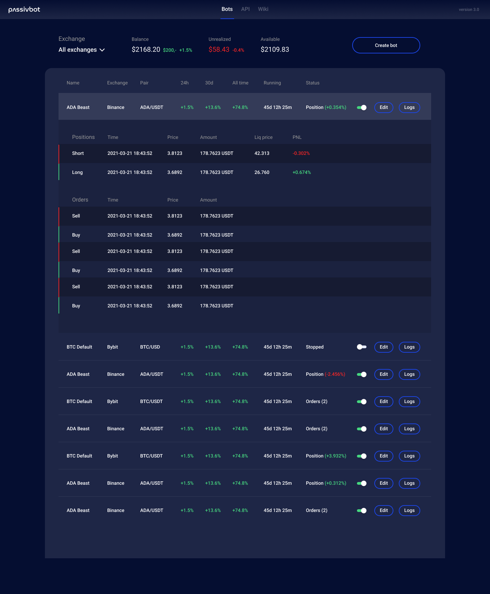

# Refactoring Information

Below is some general information about a re-structure of the codebase.
The idea is to arrange files in a way that allows for the easiest development, usage, and expansion over time.
Since this is such a broad and somewhat ambiguous process, there is no single correct way to arrange the files, although some arrangements may have benefits over others.
Thus, it's advantageous to get as much developer feedback as possible to ensure that the updated structure is easy to change, compartmentalize, test etc.
NOTHING here is final.

**Proposed Structure:** This is just temporary and will be updated as progress is made.

Individual changes to each component will be discussed within pull requests, and updated here upon completion.

> `passivbot_futures/`  
> │  
> ├── `Refactor.md`    
> ├── `README.MD`  
> ├── `main.py` &/or `start_bot.py`  
> ├── `setup.py`  
> ├── `.gitignore`  
> ├── `api-keys.json`  
> ├── `Data/`  
> │    ├── `Dockerfile`  
> │    ├── `docker-compose.yml`  
> │    ├── `changelog.txt`  
> │    ├── `requirements.txt`  
> │    └── `historical_data/`  
> └── `bot/`  
>    ├── `passivbot.py`  
>    ├── `exchanges/`  
>    │    ├── `bybit.py`  
>    │    └── `binance.py`  
>    ├── `backtester/`  
>    │    ├── `backtest.py`  
>    │    ├── `backtest_notes.ipynb`  
>    │    ├── `binanace_notes.ipynb`  
>    │    ├── `bybit_notes.ipynb`  
>    │    └── `backtest_configs/`  
>    ├── `live_settings/`  
>    │    ├── `binance/`  
>    │    └── `bybit/`  
>    └── `logs/`  

### `README.MD`  

Abstract for the program, general usage, description, version info, author information and contribution guidelines.

### `main.py` &/or `start_bot.py`  

start_bot.py should stay in the root folder for the time being for development usage.
main.py is NOT written yet, as there should be some discussion on how it is implemented.
From my somewhat novice understanding of setuptools/pypi distribution, having a main.py that acts as a central entry point for the script is best practice.
This means conceiving of *some* kind of menu or UI that allows end-users to change and use all parts of the bot from a central place.
I had experimented with command line interface menus, but given the complexity of the bot, it seems the best approach may be to run a local webapp, similar to how jupyter-lab works.
In a distribution environment, it's best to assume the end user knows absolutely nothing about how to configure or read complex json files, edit code, or otherwise.
Therefore, said webapp should include functionality to edit and add users (API keys), edit configuration files (for backtester and live bot), copy or upload an external configuration file,
and most importantly, facilitate backtesting. My inexperience may be failing me here, but it seems that the single most complex part of packaging passivbot will stem from finding a good way to implement
backtesting *and* the data analytics (currently done in jupyter) within whatever UI is selected for use. That said, this isn't a pre-requisite for a general restructure,
I just say this as it effects how the files should be laid out to make compartmental development, testing, and end usage as easy as possible.  

Martijn397 shared some work he had done in the realm of web UI on discord:  

### `setup.py`  

Contains setup instructions for producing a distribution file accepted by pypi. There's a lot of ambiguity in how this file can be written, but from my understanding, it requires a main point of entry for the final script.
i.e. Our end user opens a command line, runs "passivbot", and the UI for the bot opens, with the command line remaining in the background to keep a log.
Therefore, setup.py needs to know information about the author, command alias, descriptions etc, but most importantly *what* to run when the user types that command.

### `.gitignore`  

Contains files git will ignore. Needs no changes.  

### `Data/`  

The data directory holds all the associated development files, and data that is shared between instances of passivbot such as API keys and historical data.

